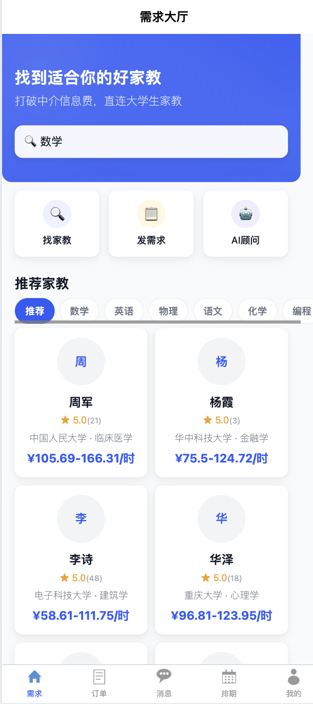
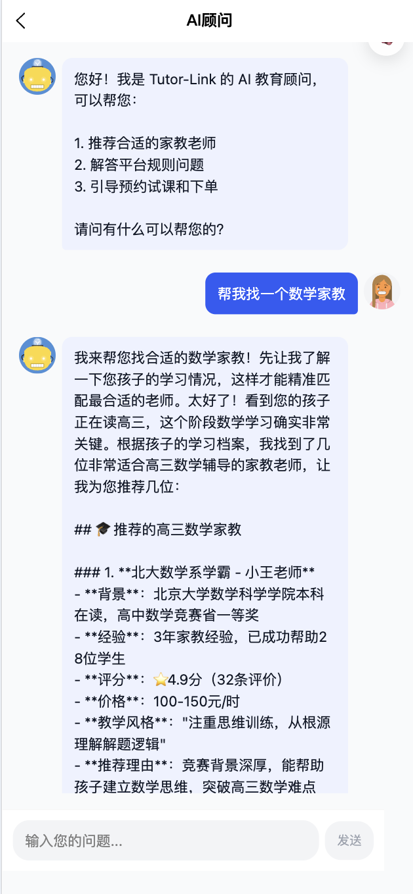
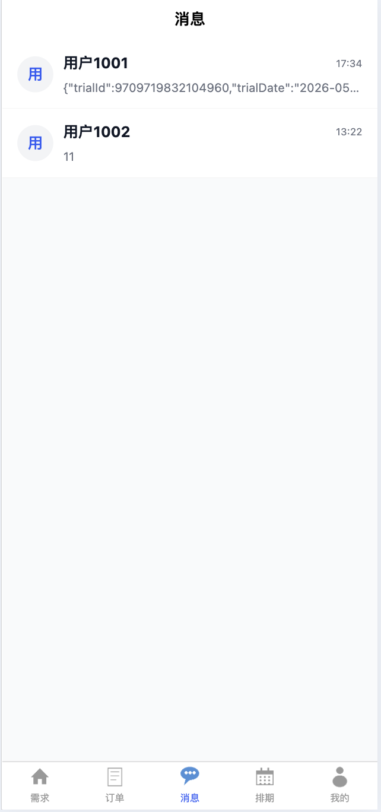
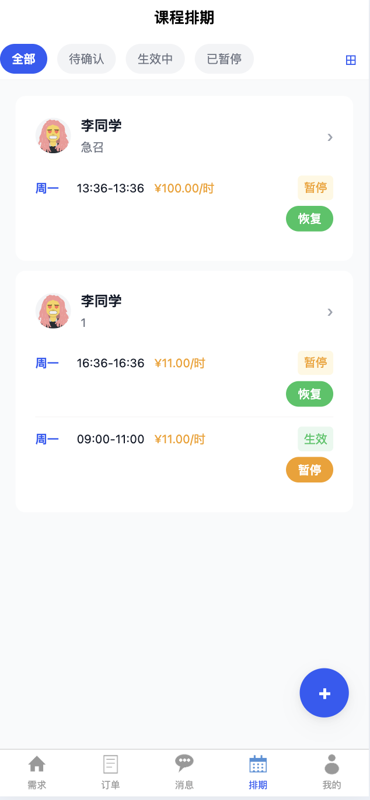
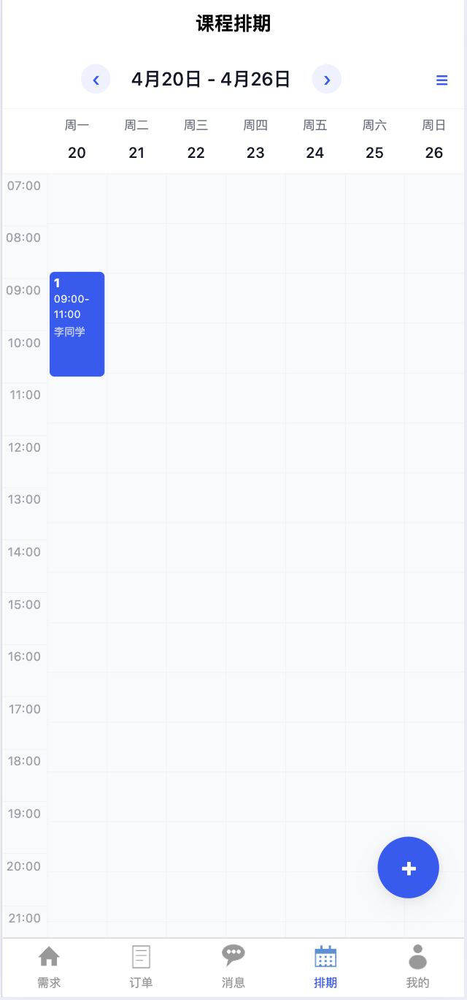

# Tutor-Link 家教直连平台

打破中介信息费，直连大学生家教与家长，让优质教育触手可及。

## 产品预览

<table>
  <tr>
    <td align="center"><b>首页 Feed 流</b></td>
    <td align="center"><b>家教详情页</b></td>
  </tr>
  <tr>
    <td></td>
    <td></td>
  </tr>
  <tr>
    <td align="center"><b>即时聊天</b></td>
    <td align="center"><b>订单管理</b></td>
  </tr>
  <tr>
    <td></td>
    <td></td>
  </tr>
  <tr>
    <td align="center" colspan="2"><b>管理后台</b></td>
  </tr>
  <tr>
    <td align="center" colspan="2"></td>
  </tr>
</table>

## 项目简介

Tutor-Link 是一个全栈家教直连平台，连接家长与在校大学生家教，去除传统中介环节和信息费。平台支持：

- **智能搜索** — 按科目、关键词搜索家教，Feed 流无限滑动浏览推荐
- **AI 顾问** — 内置 AI 客服，跨会话长期记忆，辅助家长精准匹配家教
- **即时沟通** — 家长与家教实时聊天，支持消息通知
- **订单全流程** — 发需求 → 家教接单 → 排课 → 试课 → 正式上课 → 评价
- **微信支付** — 支持微信支付与退款
- **管理后台** — Vue 3 + Element Plus + ECharts，数据可视化与用户管理

## 技术架构

```
┌──────────────────────────────────────────────────────┐
│                    Nginx (反向代理)                     │
├──────────┬──────────┬──────────┬──────────────────────┤
│  微信小程序  │  管理后台   │  WebSocket │     静态资源        │
│  uni-app   │  Vue 3    │   STOMP    │                    │
├──────────┴──────────┴──────────┴──────────────────────┤
│              Spring Boot 3.2.5 (tutor-link-web)        │
├────────────────────────────────────────────────────────┤
│  tutor-link-service — 业务逻辑 (订单状态机/搜索/AI/支付)   │
├───────────┬────────────┬────────────┬─────────────────┤
│   common  │   model    │    dao     │       mq        │
│  常量/异常  │  实体/DTO   │  MyBatis-Plus │   Kafka      │
├───────────┴────────────┴────────────┴─────────────────┤
│            MySQL 8  │  Redis 7  │  Kafka 3 (KRaft)     │
└────────────────────────────────────────────────────────┘
```

**六模块 Maven 依赖链：**

```
common → model → dao ─┬→ service → web  (Spring Boot 入口)
                       └→ mq ──────────┘
```

| 模块 | 职责 |
|------|------|
| **common** | 常量 (`ResultCode`, `OrderStatus`)、异常、`ApiResult<T>` 响应封装、JWT/雪花ID工具 |
| **model** | JPA/MyBatis-Plus 实体、DTO、枚举，继承 `MpBaseEntity` |
| **dao** | MyBatis-Plus Mapper 接口 |
| **mq** | Kafka Topic 定义、生产者、消息 DTO |
| **service** | 业务逻辑：订单状态机、事务发件箱、搜索、AI 顾问、支付、聊天 |
| **web** | Controller、Spring Security、JWT 过滤器、WebSocket、Flyway 迁移 |

## 核心设计

### 订单状态机

9 个状态、完整生命周期管理，Redis ZSET 实现 30 分钟超时自动取消：

```
PENDING → ACCEPTED → SCHEDULED → TRIAL → CONFIRMED → IN_PROGRESS → COMPLETED
   │          │           │         │
   ↓          ↓           ↓         ↓
 CANCELLED  CANCELLED  CANCELLED  CANCELLED
```

### 事务发件箱模式

保证 Kafka 消息可靠投递：业务数据 + Outbox 在同一 DB 事务中写入 → `OutboxRelayScheduler` 每秒扫描发 Kafka → 失败进入 DLT 重试。

### 角色体系

Bitmask 角色设计，支持多角色叠加：PARENT=1, TUTOR=2, ADMIN=4

## 技术栈

| 类别 | 技术 |
|------|------|
| 后端框架 | Spring Boot 3.2.5 / Java 17 |
| ORM | MyBatis-Plus 3.5.6 |
| 数据库 | MySQL 8.x |
| 缓存 | Redis 7.x |
| 消息队列 | Apache Kafka 3.x (KRaft) |
| 认证 | JWT (JJWT 0.12.5) |
| API 文档 | Knife4j 4.4.0 |
| 小程序 | uni-app (Vue 3 + Pinia + Vite) |
| 管理后台 | Vue 3 + Element Plus + ECharts |
| 部署 | Docker Compose + Nginx |

## 快速开始

### 环境要求

- Java 17+（开发机 Java 26 需 Lombok 1.18.38+）
- Maven 3.8+
- MySQL 8.x
- Redis 7.x
- Apache Kafka 3.x（KRaft 模式）
- Node.js 18+

### 一、启动基础设施

```bash
# Docker Compose 一键启动
docker-compose up -d mysql redis kafka

# 或确保本地 MySQL(3306)、Redis(6379)、Kafka(9092) 端口可用
```

### 二、配置环境变量

复制示例配置并填写：

```bash
cp .env.example .env
# 编辑 .env 填写数据库密码、API Key 等
```

Flyway 会在首次启动时自动执行 `db/migration/V1-V17__*.sql` 创建表结构和测试数据。

### 三、启动后端

```bash
# 构建所有模块
mvn clean package -DskipTests

# 启动应用
mvn spring-boot:run -pl tutor-link-web
```

启动成功后访问：
- API 文档：http://localhost:8080/doc.html

### 四、启动前端

```bash
# 微信小程序（家长端）
cd tutor-link-miniapp
npm install
npm run dev:mp-weixin    # 微信开发者工具导入 dist/dev/mp-weixin
npm run dev:h5           # 或浏览器直接预览 H5

# 管理后台
cd tutor-link-admin
npm install
npm run dev              # http://localhost:5173
```

### 五、Docker 一键部署

```bash
docker-compose up --build
```

Nginx 反向代理，端口映射：80(HTTP)、443(HTTPS)、8080(应用)。

## 环境变量

| 变量 | 说明 | 默认值 |
|------|------|--------|
| `MYSQL_HOST` | MySQL 地址 | localhost |
| `MYSQL_PORT` | MySQL 端口 | 3306 |
| `MYSQL_DB` | 数据库名 | tutor_link |
| `MYSQL_USER` | 数据库用户 | root |
| `MYSQL_PASSWORD` | 数据库密码 | (空) |
| `REDIS_HOST` | Redis 地址 | localhost |
| `REDIS_PORT` | Redis 端口 | 6379 |
| `REDIS_PASSWORD` | Redis 密码 | (空) |
| `KAFKA_SERVERS` | Kafka 地址 | localhost:9092 |
| `JWT_SECRET` | JWT 签名密钥 | (内置开发密钥) |
| `WX_APPID` / `WX_SECRET` | 微信小程序凭证 | - |
| `OSS_*` | 阿里云 OSS 配置 | - |
| `ANTHROPIC_API_KEY` | AI 顾问 API Key | - |

## License

MIT
